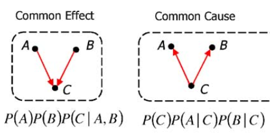

# Inferring causality

Reading: Steyvers, Mark, Joshua B. Tenenbaum, Eric-Jan Wagenmakers, and Ben Blum. “Inferring Causal Networks from Observations and Interventions.” Cognitive Science 27, no. 3 (May 2003): 453–89.

## Setup

There are three aliens, which we can call A, B, and C. *At each timestep*, a Bayesian learner makes one observation, which consists of one word for each alien. There are $n$ possible words. After a certain number of timesteps $T$ (i.e. after having made $T$-many observations), the learner has to infer which alien is reading which alien's mind based on the observed groups of words (which we will call 'the data' $D$). There are two possible causal structures:

- CC (common cause model): A and C both read C's mind. A <- C -> B. First, a random word is chosen for C. Then, A and B independently get the same word as C with probability $\alpha$, and a random word (which could possibly be the same as C's word, by chance) with probability $1-\alpha$.
- CE (common effect model): C can read both A's and B's minds. A -> C <- B. First, a random word is selected for A and a random word is selected for B. Then, C reads both A's and B's minds, each with independent probability of success $\alpha$, i.e. with probability $\alpha$ they read the right word and with probability $1-\alpha$ they read the wrong word. If C reads both minds, it produces one of the two read words at random. If it fails to read both minds, it produces a random word.



In the model below $\alpha=0.8$ and $n=10$.

There are 4 patterns with different probability, because the specific words don't matter: all that matters is which aliens produce the same or different words. Here they are:

```{r table2, echo=FALSE, message=FALSE, warnings=FALSE, results='asis'}
tabl <- "
Index | Case $d$                                  | Description           | $P(d | CC)$  | $P(d|CE)$ |
-----:|:------------------------------------------|:----------------------|:-------------|:----------|
1     | $A=B=C$                                   | All same              | 0.67         | 0.096     |
2     | $A=C$ and $B != C$ or $B=C$ and $A != C$  | Two connected same    | 0.3          | 0.87      |
3     | $A=B$ and $A!= C$                         | Two disconnected same | 0.0036       | 0.0036     |
4     | $A!= B$ and $B != C$ and $A != C$         | All different         | 0.029        | 0.029     |
"
cat(tabl)
```

Draw them to get a sense of what the possible cases are and why they are different from each other.

## Approximating the likelihood with a simulation

The probability of two words being the same by chance is 10/100, i.e. 0.1. How to get the probabilities above for each case and each hypothesis? Let's consider an example: the first case (where $A=B=C$) for hypothesis CC (A <- C -> B) can be obtained in four different ways. First, both A and B correctly read C's mind (two events of probability 0.8 happen, so 0.8\*0.8). Second, A correctly reads C's mind and B just happens to get the same word (0.8\*0.2\*0.1). Third, B correctly reads C's mind and A just happens to get the same word (0.8\*0.2\*0.1). Finally, neither A nor B correctly read C's mind, but they both just happen to get the same word (0.2\*0.1\*0.2\*0.1).

It is a bit laborious to determine the probabilities by enumerating the possible events. However, we can do it by sampling! I.e. we simulate a bunch of times what happens given an hypothesis and see what proportions of the samples have e.g. A=B=C, and that gives us an approximation of the probability of each observation given the hypothesis. Let's write a function to sample under CE and under CC:

```{r important-computing, cache=TRUE}

sample.bernoulli <- function(p.true=0.8){
  sample(x=c(TRUE,FALSE),size=1,prob=c(p.true,1-p.true))
}

sample.word <- function(){
  sample(x=10,size=1)
}

produce.data.CE <- function(){
  
  word.A <- sample.word()
  word.B <- sample.word()
  
  C.reads.A <- sample.bernoulli()
  C.reads.B <- sample.bernoulli()
  
  if (C.reads.A & C.reads.B){
    # both
    word.C <- sample(c(word.A,word.B),size=1)
  } else if (C.reads.A){
    # just A
    word.C <- word.A
  } else if (C.reads.B){
    # just B
    word.C <- word.B
  } else {
    # neither
    word.C <- sample.word()
  }
  
  return(c(word.A, word.B, word.C))
}

produce.data.CC <- function(){
  
  word.C <- sample.word()
  
  A.reads.C <- sample.bernoulli()
  B.reads.C <- sample.bernoulli()
  
  if (A.reads.C){
    word.A <- word.C
  } else {
    word.A <- sample.word()
  }
  
  if (B.reads.C){
    word.B <- word.C
  } else {
    word.B <- sample.word()
  }
  
  return(c(word.A, word.B, word.C))
}
```

And let's test this function:

```{r}
produce.data.CE()
```

What we need next is a function that take a specific datapoint produced by the function above and categorizes it into one of the four cases described above.

```{r}
divide.cases <- function(samples){
  
  A.equals.B <- samples[1,] == samples[2,]
  A.equals.C <- samples[1,] == samples[3,]
  B.equals.C <- samples[2,] == samples[3,]
  
  # the cases above
  case.1 <- A.equals.B & A.equals.C & B.equals.C
  case.2 <- (A.equals.C & !B.equals.C) | (B.equals.C & !A.equals.C)
  case.3 <- A.equals.B & !A.equals.C
  case.4 <- !A.equals.B & !B.equals.C & !A.equals.C
  
  return(rbind(case.1,case.2,case.3,case.4))
}
```

Let's approximate the likelihood by seeing how often the 4 cases happen under each of the two hypotheses:

```{r}
n=500000

samples.CC <-
  rowMeans(divide.cases(replicate(n, produce.data.CC())))

samples.CE <-
  rowMeans(divide.cases(replicate(n, produce.data.CE())))

print(samples.CC)
print(samples.CE)
```

You can see that these approximations are pretty close to the ones in the paper!

## Bayesian inference

Just to be extra clear,

- the hypotheses here are $CC$ and $CE$
- the data $D$ is a series of observations $d_1, d_2, ..., d_T$, where each $d$ consists of three words (well, in the code we use numbers instead of words because it's easier).

Now we have all the ingredients we need to do Bayesian update, namely the likelihood (the probability of a causal structure given a datapoint, which is described by the table above) $P(\text{data }=D \mid \text{hypothesis }=CC)$ and $P(\text{data }=D \mid \text{hypothesis }=CE)$, and the prior over hypotheses (which we assume is uniform, so each of the two possible hypotheses gets 0.5) $P(\text{hypothesis }=CC)$ and $P(\text{hypothesis }=CE)$. We calculate the posterior as usual:

$$
P(CC \mid D) = \frac{P(D \mid CC) P(CC)}{P(D \mid CC) P(CC) + P(D \mid CE) P(CE)}
$$

and

$$
P(CE \mid D) = \frac{P(D \mid CE) P(CE)}{P(D \mid CC) P(CC) + P(D \mid CE) P(CE)}
$$

There is one number that we can use in this model to guess which hypothesis is true, namely $\phi$. This is the logarithm of the posterior over one hypothesis divided by the other, which is equal to:

$$
\phi = \log\frac{P(CC \mid D)}{P(CE \mid D)} \\
$$

The reason this quantity is important is the following: 

*_When $\phi$ is greater than 0, the data favours hypothesis CC. The greater the $\phi$, the more the data favors hypothesis CC. When $\phi$ is 0, the data is neutral between the two hypotheses. When $\phi$ is smaller than 0, the data favors CE. The more negative the $\phi$, the more the data favours CE._*

There is an equivalent, simpler way of calculating $\phi$ just by using the likelihood of the individual observations at each timestep $t$ up to the final timestep $T$ (assuming a uniform prior over hypotheses):

$$
\phi = \sum_{t=1}^{T} \log \frac{P(d_t \mid CC)}{P(d_t \mid CE)}
$$

Note that this sum really means:

$$
\log \frac{P(d_1 \mid CC)}{P(d_1 \mid CE)} + \log \frac{P(d_2 \mid CC)}{P(d_2 \mid CE)} + ... + \log \frac{P(d_T \mid CC)}{P(d_T \mid CE)}
$$

You don't need to understand why the two are equivalent (see Appendix 1 if you're curious).

## One complication from real participants

Up until this point in the course, we have modelled mostly perfect Bayesian agents, namely agents that learn and behave conforming perfectly to Bayes' theorem (although sometimes their generative model might not accurately described reality). However, this paper shows us an interesting new direction: if we are interested in modeling real human participants, we can assume a Bayesian learner and then add on top of it some transformations that approximate 'irrationality'. This might be a bit confusing now but should become clearer in the rest of this section.

The type of 'irrationality' we will add to the model concerns the way the learner actually selects an hypothesis given their posterior probability after seeing the data. A 'perfect' Bayesian agent would simply select the hypothesis, between CC and CE, that has the highest posterior probability. This would mean selecting CC whenever $\phi > 0$ and CE whenever $\phi <0$ (Can you explain why?). However, real humans might not be so rational. Rather, in the model they might not be as sure. Therefore, we write $P(\text{guessing }CC)$ (the probability that they will choose the $CC$ hypothesis) as follows:

$$
P(CC) = \frac{1}{1+e^{-\gamma \phi}}
$$

This is a case of the famous _logistic function_ $\frac{1}{1+e^{-x}}$, where $x$ is set to $\gamma\phi$. The logistic function can be used when you want to 'squeeze' a value below 0 or above 1 between 0 and 1.

Let's plot this for different values of the parameters to get a feeling of the behaviour (with the probability of the data given CE fixed to 0.4):

```{r}
p.function <- function(p.data.given.CC, p.data.given.CE, gamma.var){
  phi.var <- log(p.data.given.CC/p.data.given.CE)
  value <- 1/(1+exp(-gamma.var*phi.var))
  return(value)
}

values.of.gamma <- c(0.1, 0.5, 1, 2, 4)
col <- heat.colors(length(values.of.gamma), rev=TRUE)
for (i in seq_along(values.of.gamma)){
  curve(
    p.function(x, 0.4, values.of.gamma[i]),
    from = 0,
    to = 1,
    col = col[i],
    add = i != 1,
    xlab = '',
    ylab = ''
  )
}

legend(0.8, 0.5, values.of.gamma, col=col, lty=1, title=expression(gamma))

title(
  expression("Prob of picking hypothesis CC given D and "*gamma),
  xlab='P(CC|D)', ylab='P(CC)'
)
```

The plot shows for each possible posterior probability of $CC$ given the data, the probability of selecting $CC$ as the true hypothesis. A couple things to note about the plot:

- Across all values of $\gamma$, all the lines agree on three points: 0 ($P(CE|D)=1$), 0.5 ($P(\text{guessing }CC)=0.5$), and 1 ($P(CC|D)=0$). This means that according to this model of hypothesis selection you will always pick an hypothesis if it has probability 1, and if the two hypothesis are equally likely to have produced the data changing the value of $\gamma$ will not make you lean towards either hypothesis.
- When $\gamma$ is close to 0, the data only makes a small impact on the probability of choosing one hypothesis or the other (unless the data completely excludes one or the other hypothesis). When $\gamma$ gets larger, even a small support for one or the other hypothesis means that the agent will likely choose it.

## Putting it all together

Now we have a full model of how participants infer the true causal model given some data. Let's implement it. Let's produce some data to train the participant. We have the function to produce data for CE above, but let's write it for CC too here:

```{r}
n.datapoints <- 100

# we can use empirical proportions obtained above by sampling
# this is a close enough approximation
likelihoods.CC <- t(t(samples.CC))
likelihoods.CE <- t(t(samples.CE))

# produce n.datapoints datapoints from world where CC is true
data <- replicate(n.datapoints,produce.data.CC())
```

Then, we get the likelihoods of the produced datapoints under the hypotheses:

```{r}
# get the likelihoods of the observed datapoints under hypothesis CC
likelihoods.data.CC <- colSums(ifelse(
  divide.cases(data),
  replicate(n.datapoints,likelihoods.CC),
  0.
))

# and same for CE, for the same datapoints
likelihoods.data.CE <- colSums(ifelse(
  divide.cases(data),
  replicate(n.datapoints,likelihoods.CE),
  0.
))
```

Finally, we calculate $\phi$ at each timestep:

```{r}
# cumulative phi as observations are received
phi <- cumsum(log(likelihoods.data.CC/likelihoods.data.CE))

plot(phi)
```

And from $\phi$ calculate the probability of accepting hypothesis CC at each timestep.

```{r}
gamma <- 0.05
p.choosing.CC <- 1/(1+exp(-gamma*phi))
plot(p.choosing.CC)
```

## Exercises

1. Make CE the true hypothesis instead and plot $\phi$ over 100 timesteps.
1. How do different values of $\alpha$ affect the results? Please plot them!
1. What happens when $\gamma$ becomes 0?
1. What is the effect of increasing and decreasing the $\gamma$ parameter on the way $\phi$ changes over time?

## Appendices (You don't need to understand them)

### Appendix 1

\begin{align}
\phi
&= \log\frac{P(CC \mid D)}{P(CE \mid D)} \\
&= \log \left( \frac{\left( \frac{P(CC)P(D \mid CC)}{P(D)}\right) }{\left( \frac{P(CE)P(D \mid CE)}{P(D)}\right)} \right) \\
& \textrm{Multiply numerator and denominator by $P(D)$:} \\
&= \log \frac{P(CC)P(D \mid CC)}{P(CE)P(D \mid CE)} \\
& \textrm{Go from log of product to sum of logs:} \\
&= \log \frac{P(CC)}{P(CE)} + \log \frac{P(D \mid CC)}{P(D \mid CE)} \\
& \textrm{Uniform prior over the two hypotheses, so first term becomes log of 1 (i.e., 0):} \\
&= \log \frac{P(D \mid CC)}{P(D \mid CE)} \\
& \textrm{Observations are independent:} \\
&= \log \prod_{t=1}^{T} \frac{P(d_t \mid CC)}{P(d_t \mid CE)} \\
& \textrm{Log transforms product into sum:} \\
&= \sum_{t=1}^{T} \log \frac{P(d_t \mid CC)}{P(d_t \mid CE)} \\
\end{align}

### Appendix 2: $\gamma=1$.

\begin{align}
P(CC) 
&= \frac{1}{1+e^{-\gamma\log \frac{P(D \mid CC)}{P(D \mid CE)} }} \\
&= \frac{1}{1+e^{\log \left( \left( \frac{P(D \mid CC)}{P(D \mid CE)} \right)^{-\gamma} \right) }} \\
&= \frac{1}{1+e^{\log \left( \left( \frac{P(D \mid CE)}{P(D \mid CC)} \right)^\gamma \right) }} \\
&= \frac{1}{1+ \left( \frac{P(D \mid CE)}{P(D \mid CC)} \right)^\gamma} \\
&= \frac{1}{ 1+ \frac{P(D \mid CE)}{P(D \mid CC)} } \\
&= \frac{1}{ \frac{P(D \mid CC)+P(D \mid CE)}{P(D \mid CC)}} \\
&= \frac{P(D \mid CC)}{P(D \mid CC)+P(D \mid CE)} \\
&= P(CC \mid D)
\end{align}

### Appendix 3: Another complication

The second complication in the model is the Bayesian learner might put less emphasis on older observations, i.e. they might play a smaller role in determining the posterior distribution. Recall from above that:

$$
\phi = \sum_{t=1}^{T} \log \frac{P(d_t \mid CC)}{P(d_t \mid CE)}
$$

Now, if one of the terms of the sum is 0, then it plays no role in determining $\phi$, and therefore in the resulting probability of accepting one hypothesis or the other. Note: the term of the sum is going to be 0 when the argument of the $\log$ (the fraction) is 1, i.e. when the two hypotheses are equally probable. This makes sense, since that's what happens when the data doesn't privilege one hypothesis over the other. 

What we can do to simulate decreasing importance of information in the past is to 'shrink' the terms of the argument towards 0. The terms we shrink completely to 0 are equivalent to the agent disregarding the information contained in that observation. In particular, we want earlier observations to be shrunk more, as we are imagining that the participant will take more recent observations more into account. 

What we need is to multiply each term of the sum with a function of $t$ that increases with increasing $t$. Here's one such function, where $\delta$ controls how fast the function shrinks towards zero when going towards the past:

$$
e^{-\frac{T-t}{\delta}}
$$

Let's plot it to make sure it has the shape we want (where $t$ ranges from 1 to $T$ included):

```{r}
T = 10

time.discount.f = function(t, T, delta){
  return(exp(-(T-t)/delta))
}

values.of.delta <- c(0.1, 0.5, 1, 2, 4, 10)
col <- heat.colors(length(values.of.delta), rev=TRUE)
for (i in seq_along(values.of.delta)){
  curve(
    time.discount.f(x, T, values.of.delta[i]),
    from = 1,
    to = T,
    col = col[i],
    add = i != 1,
    xlab = '',
    ylab = ''
  )
}

legend(1, 1., values.of.delta, col=col, lty=1, title=expression(delta))

title(
  expression("Discounting factor for term t with given "*delta),
  xlab='t', ylab='Discounting factor'
)
```

When $\delta=0$, everything but the $T$th weight is 0. When $\delta=\inf$, every weight is 1. Therefore, we can use $\delta$ to control the 'amount' of rationality.

Finally, the other complication. The plot shows, as the observations come in, the probability of choosing hypothesis CC. Since CC is the true hypothesis, you can see that the agent slowly becomes more and more convinced of it:

```{r}
gamma <- 0.05
p.choosing.CC <- 1/(1+exp(-gamma*phi))
plot(p.choosing.CC)
```

Now let's add the time discounting complication described above. 

```{r}
delta <- 50

log.proportion <- log(likelihoods.data.CC/likelihoods.data.CE)
phi <- c()
for (i in 1:n.datapoints){
  time.discount <- unlist(lapply(
    1:i,
    time.discount.f,
    T=i,
    delta=delta
  ))
  new.phi <- sum(log.proportion[1:i] * time.discount)
  phi <- c(phi,new.phi)
}
plot(phi)
```
